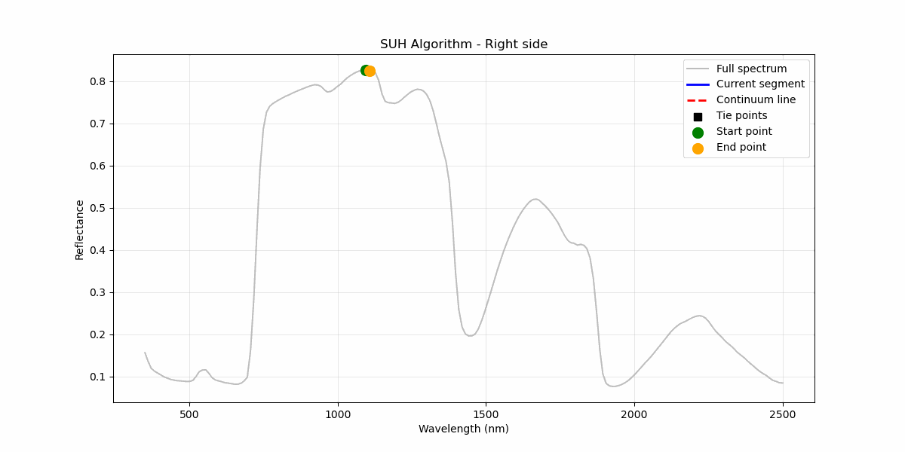

# Segmented Upper Hull (SUH) Continuum Removal

A Python implementation of the Segmented Upper Hull method for spectral continuum removal, following Clark et al. (1987).

## Overview
The Segmented Upper Hull (SUH) method identifies local maxima in reflectance spectra and constructs a piecewise linear 
continuum without enforcing convexity. Unlike standard convex hull methods, SUH allows extraction of more detailed 
absorption features.

The implementation follows the algorithm described in Clark et al. (1987) as Segmented Upper Hull (SUH):
- find the global maximum of the reflectance vector, split the spectrum at this point
- iteratively find local maxima in each segment.
- to ensure all datapoints (reflectance values) are below the continuum, segments are created by connecting local maxima testing if continuum removed spectrum (CRS) > 1.
- if CRS > 1, the envelope/hull does not fit. The respective point is added as a tie point.
- repeat until all points are below the continuum.

### Animation of SUH iterative fitting
  
  


### comparison to convex hull


Notice how prominent peaks at ~550 nm and ~1700 nm are missed by the convex hull, due to the convexity constraint.

## Requirements
Python version: ~= 3.10  
NumPy version: >= 2.2  
SciPy version: >= 1.15  

## Usage

```python
# <various imports> #

from segmented_upper_hull import segmented_upper_hull

# load data
data = pd.read_csv('data/dummy_spectrum.csv')
wavelengths = data['wavelengths'].values
reflectance = data['reflectance'].values

# perfrom SUH continuum removal to get band_depths
band_depth = segmented_upper_hull(reflectance, wavelengths, return_type="band_depth")

# alternatively query all results as a dictionary
results = segmented_upper_hull(reflectance, wavelengths, return_type="all")

# for row-wise processing of a 2D array (e.g. multiple spectra)
data.apply(lambda row: segmented_upper_hull(row.values, wavelengths=wavelengths, return_type='band_depth'), axis=1,
    result_type='expand')

# mode details see SUH_example.ipynb
```


## References
Original algorithm by:

Clark, R.N., King, T.V.V., and Gorelick, N.S. (1987). Automatic continuum
    analysis of reflectance spectra. JPL Proceedings of the Third Airborne Imaging
    Spectrometer Data Analysis Workshop, 138-142.
    https://ntrs.nasa.gov/citations/19880004388
    https://ntrs.nasa.gov/api/citations/19880004388/downloads/19880004388.pdf

implementation by:  

Leander Leist (2025), Laboratory of Climatology and Remote Sensing (LCRS), University of Marburg, Germany

## Citation:
Please cite the original authors:
```bibtex
@inproceedings{clark1987automatic,
  author    = {Clark, R.N. and King, T.V.V. and Gorelick, N.S.},
  title     = {Automatic continuum analysis of reflectance spectra},
  booktitle = {JPL Proceedings of the Third Airborne Imaging Spectrometer Data Analysis Workshop},
  pages     = {138--142},
  year      = {1987},
  url       = {https://ntrs.nasa.gov/citations/19880004388},
  note      = {PDF: \url{https://ntrs.nasa.gov/api/citations/19880004388/downloads/19880004388.pdf}}
}
```
and 
```bibtex
@misc{leist2025suh,
  author       = {Leist, Leander},
  title        = {Segmented Upper Hull (SUH) Continuum Removal: A Python implementation of the Segmented Upper Hull Algorithm for spectral continuum removal, following Clark et al. (1987)},
  year         = {2025},
  note         = {Laboratory of Climatology and Remote Sensing (LCRS), University of Marburg, Germany, GitHub: \url{https://github.com/leleist/segmented_hull}}
}
```

## License
This project is licensed under the MIT License - see the LICENSE file for details.


 